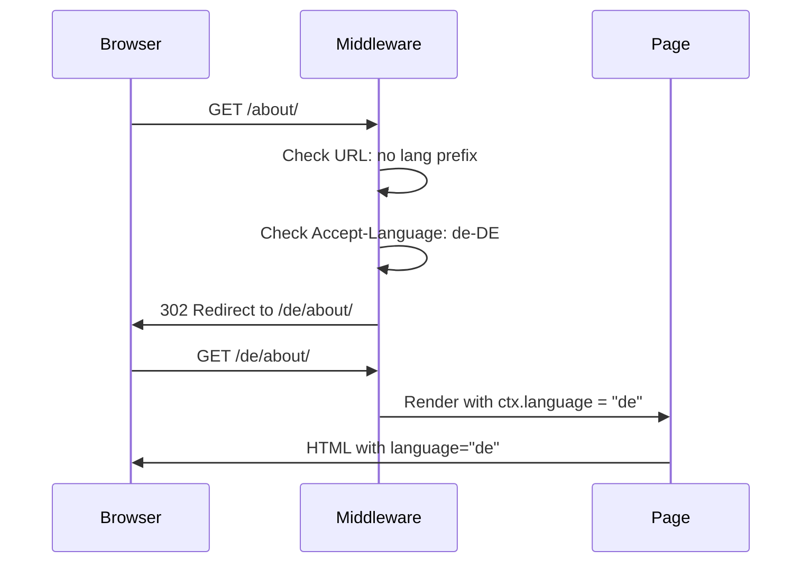

# Visitor Language Detection

How the system detects and persists visitor language preferences.

> **Repository invariant**: Cookies are forbidden. All persistence uses `localStorage` (client) and `Accept-Language` (server). See root `AGENTS.md` → Storage policy.

## Overview

Per [RFC-0038](../../docs/rfcs/RFC-0038-content-declared-language-configuration-and-visitor-language-detection.md), language detection uses two layers:

- **Server-side middleware** — URL path + `Accept-Language` header
- **Client-side script** — `localStorage` persistence + `navigator.language`

## Detection Order

### Server (middleware)

```
1. URL path        → /en/about/ (language in URL)
2. Accept-Language → Browser language header
3. Default         → Fallback to i18n.default
```

### Client (language-persist.ts)

```
1. URL path        → window.location.pathname
2. localStorage    → Previously saved preference
3. navigator       → Browser language
4. Default         → Fallback
```

Configure the server-side order in `system.md`:

```yaml
i18n:
  detection:
    order: ["url", "acceptLanguage", "default"]
```

## Detection Sources

### 1. URL Path

**Priority**: Highest

The language code in the URL path takes precedence:

```
https://example.com/en/about/  → Detects "en"
https://example.com/de/        → Detects "de"
```

**Implementation**: The middleware checks if the first path segment matches a supported language code.

### 2. Accept-Language Header (server only)

**Priority**: Medium

Browser sends preferred languages:

```http
Accept-Language: de-DE,de;q=0.9,en-US;q=0.8,en;q=0.7
```

**Parsing Rules**:

1. Split by comma
2. Parse quality value (`q=0.9`)
3. Sort by quality (highest first)
4. Match against supported languages

**Fuzzy Matching**: Enabled by default

```yaml
i18n:
  detection:
    acceptLanguageFuzzyMatch: true  # "en-US" matches "en"
```

### 3. localStorage (client only)

**Priority**: Medium (client-side)

Client-side JavaScript persists the user's choice:

```javascript
// Saved when user clicks language switcher
localStorage.setItem("preferredLanguage", "es");
```

**Security**: localStorage is isolated per origin (domain + protocol + port).

### 4. Default Fallback

**Priority**: Lowest

If no source matches, use `i18n.default`:

```yaml
i18n:
  default: de
  supported:
    de: { name: "Deutsch", ... }
    en: { name: "English", ... }
```

## Middleware Flow



## Client-Side Persistence

### Language Switcher Flow

```javascript
// User clicks "Switch to English"
function switchLanguage(lang) {
  // 1. Save to localStorage
  localStorage.setItem("preferredLanguage", lang);

  // 2. Navigate to new URL
  window.location.href = `/${lang}${currentPath}`;
}
```

### Auto-Generated Script

The `i18n.detect.implement` command generates `src/scripts/language-persist.ts`:

```typescript
// Auto-generated by i18n.detect.implement (RFC-0038)
window.__I18N__ = {
  supported: ["de", "en"],
  default: "de",
  current: "en",
  setLanguage: (lang) => { /* persists to localStorage, updates current */ }
};
```

Import in your layout:

```astro
---
// src/layouts/layout.astro
import '../scripts/language-persist';
---
```

## Server-Side Middleware

### Auto-Generated Middleware

The `i18n.detect.implement` command generates `src/middleware/language-detect.ts`:

```typescript
// Auto-generated by i18n.detect.implement (RFC-0038)
export const onRequest: MiddlewareHandler = async (context, next) => {
  const detectedLang = detectLanguage(context.request);

  // Redirect if needed
  if (!hasLangPrefix && detectedLang !== DEFAULT_LANGUAGE) {
    return Response.redirect(`/${detectedLang}${pathname}`, 302);
  }

  context.locals.language = detectedLang;
  return next();
};
```

### Detection Algorithm

```typescript
function detectLanguage(request: Request): string {
  for (const source of DETECTION_ORDER) {
    switch (source) {
      case "url":
        const pathLang = pathname.split("/")[1];
        if (SUPPORTED.includes(pathLang)) return pathLang;
        break;

      case "acceptLanguage":
        const header = request.headers.get("accept-language");
        const preferred = parseAcceptLanguage(header);
        const matched = matchLanguage(preferred, SUPPORTED);
        if (matched) return matched;
        break;

      case "default":
        return DEFAULT_LANGUAGE;
    }
  }
}
```

## Configuration Examples

### SEO-Friendly (URL-first, default)

```yaml
i18n:
  detection:
    order: ["url", "acceptLanguage", "default"]
```

### Geo-Targeted

```yaml
i18n:
  detection:
    order: ["acceptLanguage", "url", "default"]
    acceptLanguageFuzzyMatch: true
```

## Static Site Generation (SSG) Considerations

### Build-Time Behavior

During `astro build`:

- No `Accept-Language` header available
- No localStorage
- Detection falls back to URL or default

### Pre-Rendering Strategy

```yaml
i18n:
  default: de
  supported:
    de: { ... }  # Pre-rendered at / (root) and /de/
    en: { ... }  # Pre-rendered at /en/ only
```

Root path `/` always serves the default language. Other languages require prefix.

### Dynamic Rendering (SSR)

With SSR enabled, middleware runs on every request:

```javascript
// astro.config.mjs
export default defineConfig({
  output: 'server',
  // Middleware detects language and redirects
});
```

## Testing Language Detection

### Manual Testing

1. Clear localStorage
2. Set browser language to target language
3. Visit root path `/`
4. Verify redirect to `/{lang}/`

### Automated Testing

```bash
# Test with curl
curl -H "Accept-Language: es-ES" -I http://localhost:4321/
# Expect: 302 Redirect to /es/

# Test Accept-Language priority
curl -H "Accept-Language: en-US,en;q=0.9,de;q=0.8" -I http://localhost:4321/
# Expect: 302 Redirect to /en/
```

## Troubleshooting

### Infinite Redirects

**Symptom**: Browser shows "too many redirects"

**Causes**:

1. Middleware redirects but language detection still returns different language
2. Supported languages list is empty or misconfigured

**Fix**: Verify `i18n.supported` includes all possible language values.

### Language Not Persisting

**Symptom**: User selects language, but on next visit it's forgotten

**Causes**:

1. localStorage disabled in browser (private browsing mode)
2. `persistToLocalStorage: false` in config

**Fix**: Check browser console for errors, verify config.

### Wrong Language on First Visit

**Symptom**: German user sees English site on first visit

**Causes**:

1. `acceptLanguage` not in detection order
2. `acceptLanguageFuzzyMatch: false` with "de-DE" vs "de" mismatch

**Fix**: Enable fuzzy matching or add all language variants to `supported`.

## See Also

- [RFC-0038: Content-Declared Language Configuration](../../docs/rfcs/RFC-0038-content-declared-language-configuration-and-visitor-language-detection.md)
- [Language Configuration Guide](./language-configuration.md)
- [system.md Reference](./system-manifest.md)
