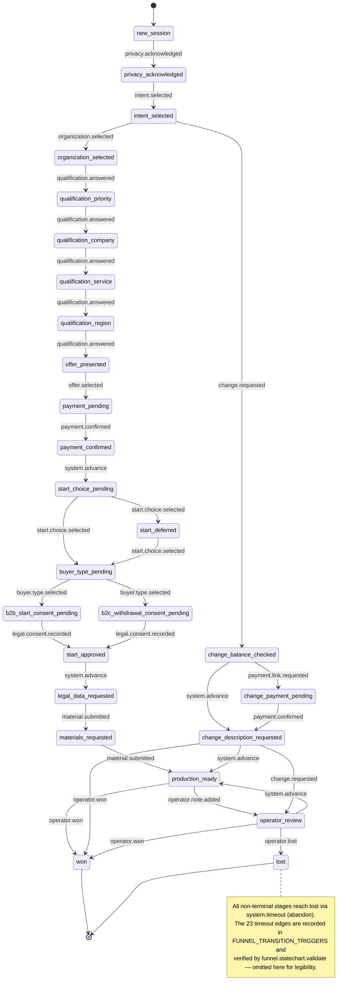
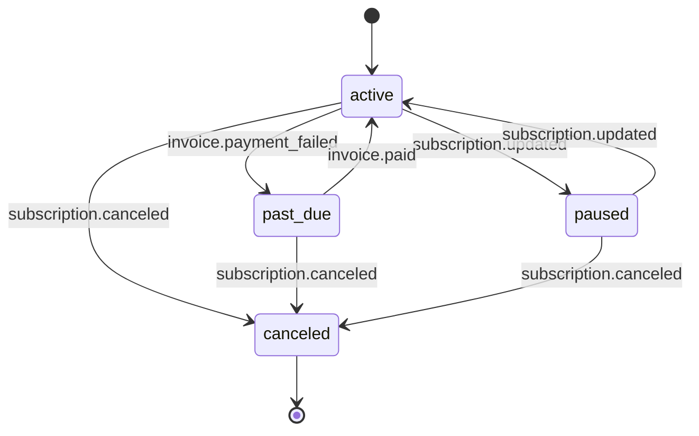

<!--
  GENERATED. Do not change this line unless the file contains project specific changes.
  DO NOT EDIT THIS FILE. Changes are overwritten on the next build.
  Owner command: funnel.statechart.generate
  Edit instead: the funnel.statechart.generate generator source (not this file).
  Regenerate:   pnpm exec site-kernel run funnel.statechart.generate
-->

# Deal Lifecycle State Chart

> Generated from `FUNNEL_TRANSITIONS` + `FUNNEL_TRANSITION_TRIGGERS` (Layer 1) and
> `SUBSCRIPTION_TRANSITIONS` + `SUBSCRIPTION_TRANSITION_TRIGGERS` (Layer 2) in
> `@gogol/integration`. Do not edit — run `funnel.statechart.generate` to regenerate.

## Layer 1 — Visitor Sales Funnel

## Layer 2 — Subscription Lifecycle

